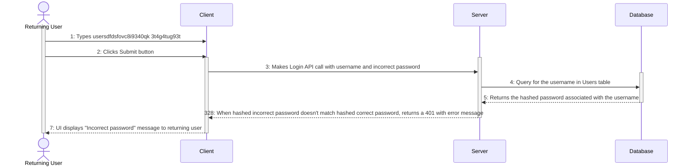

<!--This is a sample sequence diagram of login functionality using diagram as code (Mermaid)-->

```mermaid
sequenceDiagram
    actor Returning User
    participant Client
    participant Server
    participant Database
    activate Returning User
    Returning User->>Client: 1: Types usersdfdsfovc8i9340qk 3t4g4tug93t
    Returning User->>Client: 2: Clicks Submit button
    activate Client
    activate Server
    Client->>Server: 3: Makes Login API call with username and incorrect password
    activate Database
    Server->>Database: 4: Query for the username in Users table
    Database-->>Server: 5: Returns the hashed password associated with the username
    deactivate Database
    Server-->>Client: 328: When hashed incorrect password doesn't match hashed correct password, returns a 401 with error message
    deactivate Server
    Client-->>Returning User: 7: UI displays "Incorrect password" message to returning user
    deactivate Client
    deactivate Returning User
    %% The Client Calls... The Client Calls... The Client Calls
```
